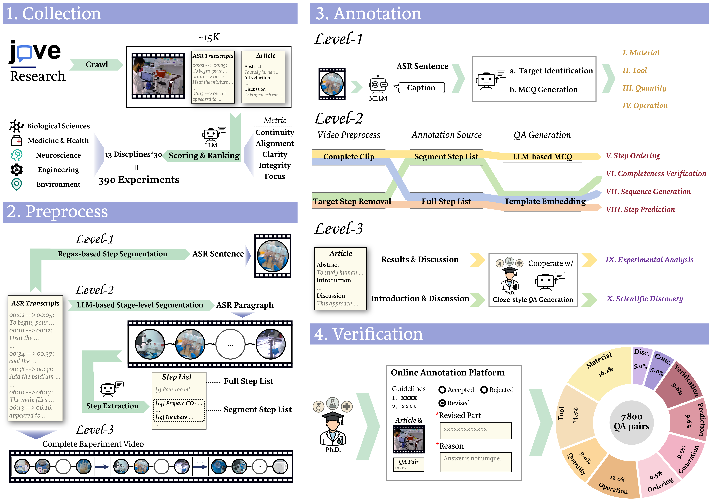

# ExpVid: A Benchmark for Experiment Video Understanding & Reasoning [\[Paper\]](https://arxiv.org/abs/xxxx.xxxxx)

[](https://huggingface.co/datasets/linghan199/ExpVid)

---

## Introduction

**ExpVid** is a benchmark designed to evaluate Multimodal Large Language Models (MLLMs) on scientific experiment videos.  
Curated from the peer-reviewed journal [JoVE](https://www.jove.com/), ExpVid includes 390 laboratory experiments across **13 scientific disciplines**.

The benchmark follows a **three-level hierarchy** that mirrors the scientific process and defines **10 tasks** across different reasoning granularities:

### Level 1: Fine-grained Perception  
Evaluates whether models can visually ground essential elements in short clips of individual experimental steps, through four multiple-choice tasks:
- **Material Recognition**  
- **Tool Recognition**  
- **Quantity Recognition**  
- **Operation Recognition**

### Level 2: Procedural Understanding  
Assesses models’ ability to reason about logical and temporal order across multiple steps within stage-level clips, including:
- **Step Ordering**  
- **Sequence Generation**  
- **Completeness Verification**  
- **Step Prediction**

### Level 3: Scientific Reasoning  
Requires models to integrate visual experiment processes with domain knowledge to draw high-level conclusions, through:
- **Experimental Analysis**  
- **Scientific Discovery**

<p align="center">
  
</p>

---

## Dataset Statistics

**ExpVid** contains **7,800 verified QA pairs** covering 10 tasks and 13 disciplines, enabling evaluation across multiple temporal and semantic scales to mimic scientific experimental process.  

|  | Temporal Scale | Avg. Duration |
|:------|:----------------|:---------------|
| Level-1 | Action-level clips | ∼8 s |
| Level-2 | Stage-level segments | ∼48 s |
| Level-3 | Full experiments | ∼8 min |

<p align="center">
  
</p>

---

## Curation Pipeline

**ExpVid** adopts a *vision-centric semi-automatic pipeline* that combines LLM-based generation with expert human validation.

<p align="center">
  
</p>

---

## Citation

If you find **ExpVid** useful for your research, please cite:

```bibtex
