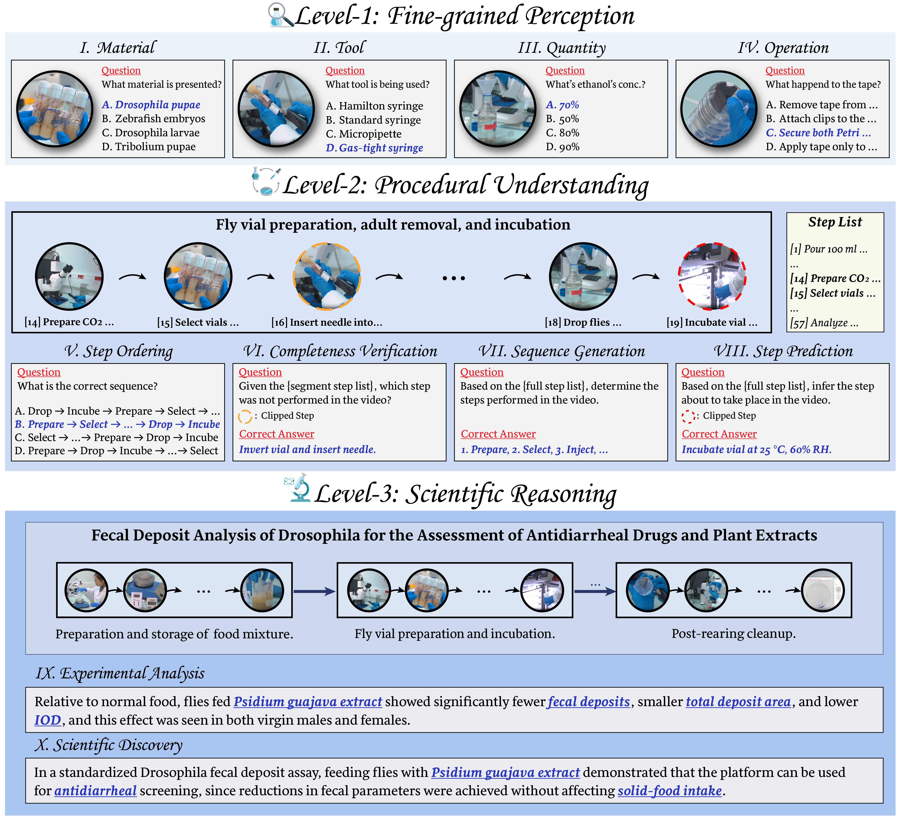

# ExpVid: A Benchmark for Experiment Video Understanding & Reasoning [\[Paper\]](https://arxiv.org/abs/xxxx.xxxxx)

[](https://huggingface.co/datasets/linghan199/ExpVid)

---

## 🔬Introduction

**ExpVid** is a benchmark designed to systematically evaluate Multimodal Large Language Models (MLLMs) on their ability to understand and reason about real-world scientific experiment videos, particularly focusing on complex wet-lab procedures.

While MLLMs show promise in general video tasks, they struggle with the fine-grained perception, long-horizon procedural logic, and scientific context required in authentic laboratory work. ExpVid bridges this gap by providing a rigorous, vision-centric evaluation framework spanning 13 scientific disciplines.

<p align="center">
  
</p>

### Features
1. Authentic Scientific Data
- Source: Curated from peer-reviewed video publications ([JoVE](https://www.jove.com/)).
- Scope: 390 high-quality experiment videos across 13 disciplines (e.g., Biology, Chemistry, Medicine).
- Rigor: Each video is linked to its corresponding peer-reviewed publication, allowing for high-level scientific reasoning tasks.

2. Three-Level Task Hierarchy
ExpVid organizes tasks into three hierarchical levels, mirroring the complexity of the scientific process, from basic observation to high-level discovery.

| Level | Focus | Temporal Scale | Tasks |
| :--- | :--- | :--- | :--- |
| **Level 1: Fine-grained Perception** | Visual grounding of basic elements. | Short Clips (~8s) | Tool Recognition, Material Recognition, Quantity Recognition, Operation Recognition. |
| **Level 2: Procedural Understanding** | Reasoning about temporal and logical sequence. | Stage Segments (~48s) | Step Ordering, Sequence Generation, Completeness Verification, Step Prediction. |
| **Level 3: Scientific Reasoning** | Integrating visual evidence with domain knowledge to draw conclusions. | Full Videos (~8 min) | Experimental Analysis, Scientific Discovery (Fill-in-the-Blank). |

3. Vision-Centric Design
Our annotation pipeline ensures that questions require visual grounding—models cannot rely solely on background knowledge or textual cues (like ASR transcripts) to answer correctly. Distractors are carefully crafted to be semantically or visually plausible, forcing models to truly "see" the experiment.

### Dataset Statistics

**ExpVid** contains **7,800 verified QA pairs** covering 10 tasks and 13 disciplines, enabling evaluation across multiple temporal and semantic scales to mimic scientific experimental process.  

|  | Temporal Scale | Avg. Duration |
|:------|:----------------|:---------------|
| Level-1 | Action-level clips | ∼8 s |
| Level-2 | Stage-level segments | ∼48 s |
| Level-3 | Full experiments | ∼8 min |

<p align="center">
  
</p>

---

## 📊Benchmark Results & Insights
We evaluated 19 leading MLLMs (both proprietary and open-source) on ExpVid. The results reveal significant limitations in current models when faced with real scientific complexity.

#### Summary of Performance (Top Models)
| Model                        | L1 (Perception) Avg. | L2 (Procedural) Avg. | L3 (Reasoning) Avg. |
|-----------------------------|---------------------|---------------------|--------------------|
| Human Baseline (Non-Expert) | 37.6                | 42.1                | N/A                |
| GPT-5 (Proprietary)         | 53.3                | 57.5                | 56.4               |
| Gemini-2.5 Pro (Proprietary)| 59.2                | 53.8                | 47.9               |
| QwenVL2.5-78B (Open-Source) | 43.9                | 35.9                | 30.6               |
| InternVL3-78B (Open-Source) | 50.9                | 41.9                | 37.7               |
| Intern-S1 (Open-Source)     | 49.9                | 36.0                | 39.6               |

### Key Findings
- The Reasoning Gap: Proprietary models (especially GPT-5) maintain a significant lead, particularly in Level 3 (Scientific Reasoning), suggesting superior ability to integrate long-context visual evidence with high-level scientific concepts.
- Weakness in Prediction & Verification: All models struggle severely with tasks requiring predictive capabilities (e.g., Step Prediction) and identifying missing information (Completeness Verification), scoring far lower than on static ordering tasks.
- Scaling Works: For open-source models (e.g., InternVL series), increasing model size consistently improves performance across all three levels of complexity.
- Visual Input is Critical: Ablation studies confirm that performance collapses without visual input, validating ExpVid's vision-centric design.

## 🛠️Getting Started
### Data Access
The ExpVid dataset, including video clips, ASR transcripts, corresponding papers, and the 7,800 QA pairs across all three levels, is be made publicly available at [Hugging Face](https://huggingface.co/datasets/OpenGVLab/ExpVid).

### Evaluation
We provide scripts and detailed instructions for evaluating MLLMs on ExpVid using the standard prompt templates used in our paper.

1. Clone the repository:
```bash
git clone https://github.com/OpenGVLab/ExpVid.git
cd ExpVid
```
2. Install dependencies
```bash
pip install -r requirements.txt
```
3. Run evaluation script:
(Detailed instructions will be provided here upon dataset release, specifying how to load models and run tests for each level.)

---

## 🌟Citation

If you find **ExpVid** useful for your research, please cite:

```bibtex
@article{xu2025expvid,
  title={ExpVid: A Benchmark for Experiment Video Understanding \& Reasoning},
  author={Xu, Yicheng and Wu, Yue and Yu, Jiashuo and Yan, Ziang and Jiang, Tianxiang and He, Yinan and Zhao, Qingsong and Chen, Kai and Qiao, Yu and Wang, Limin and Okumura, Manabu and Wang, Yi},
  journal={arXiv preprint arXiv:2510.11606},
  year={2025}
}

```

## 🤝Contact
For questions or feedback regarding the benchmark, you may join our wechat group or open issues for discussions.
